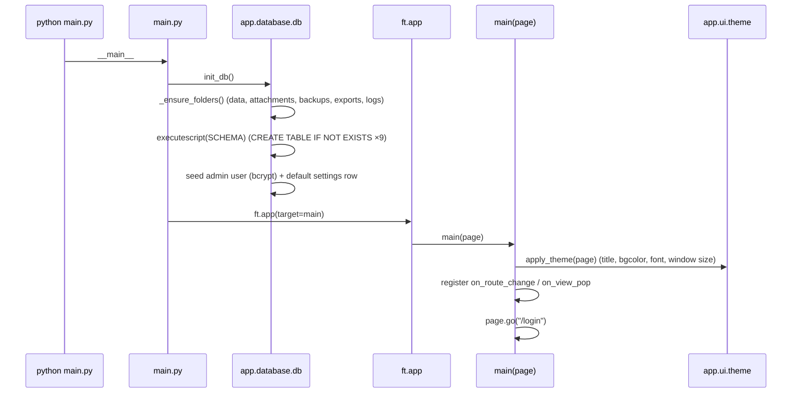
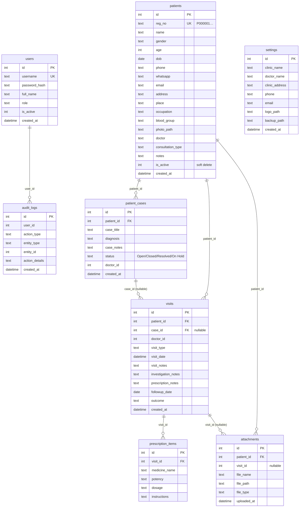
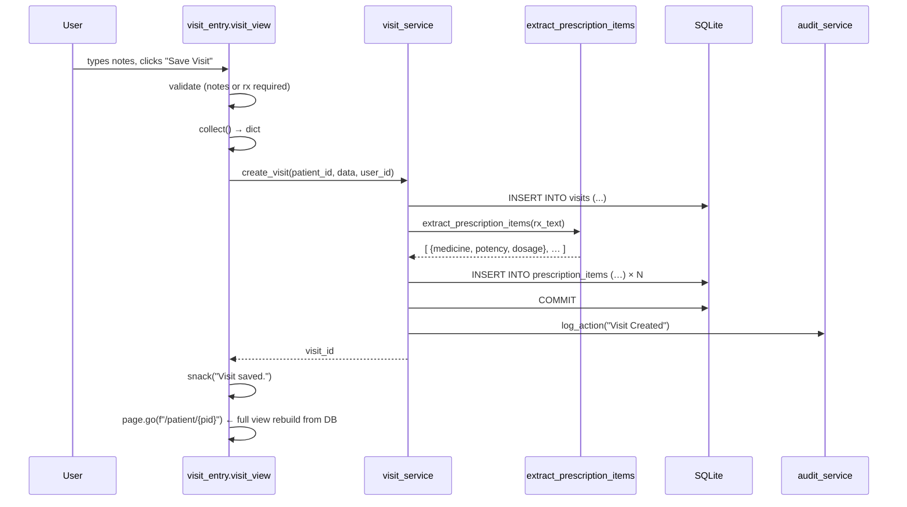
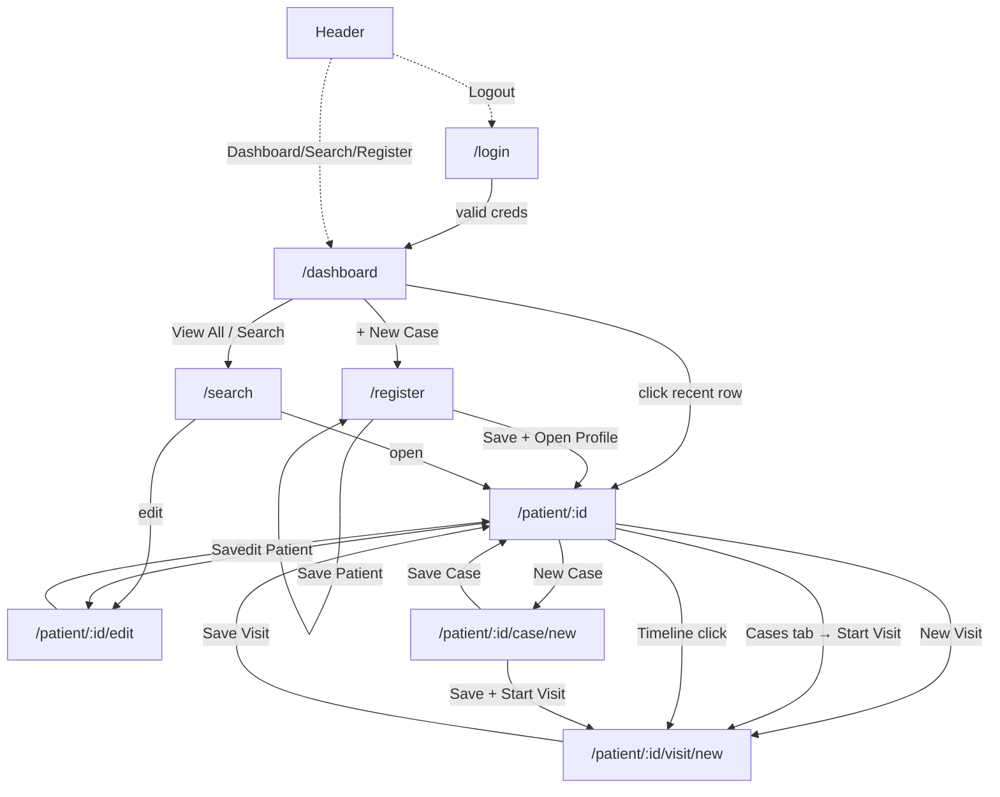

# Wise PMS — Architecture Audit (Sprint 2 / As-Built)

> **Status:** As-built snapshot of the repository **before** the Sprint 2
> architecture refactor, kept as the audit record. The refactor described in
> [`TARGET_ARCHITECTURE.md`](./TARGET_ARCHITECTURE.md) has since been
> **implemented** — see that document for the current structure and the current
> [`README.md`](../README.md) for the folder map. This file remains the
> reference for *what existed and why the changes were needed*; the module
> interaction graph is in [`DEPENDENCY_MAP.md`](./DEPENDENCY_MAP.md).

Wise PMS ("Smart Healthcare Management") is a **desktop-first, local-first,
offline** Patient Management System for a homeopathy clinic. It is built with:

| Concern            | Technology                                   |
| ------------------ | -------------------------------------------- |
| Language           | Python 3.10+                                 |
| UI framework       | [Flet](https://flet.dev) `0.28.3` (Flutter renderer for Python) |
| Persistence        | SQLite (single local file `data/wise_pms.db`) |
| Password hashing   | `bcrypt` ≥ 4.0                               |
| Packaging (target) | PyInstaller → `WisePMS.exe` (Windows)        |
| Cost / network     | ₹0/month, no cloud, no internet required     |

---

## 1. Folder structure (as-built)

```
Wise-PMS/
├── main.py                     # Entry point: init_db() + Flet app + router
├── requirements.txt            # flet==0.28.3, bcrypt>=4.0
├── README.md                   # User-facing setup / Sprint notes
├── app/
│   ├── __init__.py             # (empty)
│   ├── database/
│   │   └── db.py               # Paths, connection, SCHEMA, init_db()  ← NO __init__.py
│   ├── services/               # Business logic + raw SQL             ← NO __init__.py
│   │   ├── auth_service.py
│   │   ├── patient_service.py
│   │   ├── case_service.py
│   │   ├── visit_service.py
│   │   ├── attachment_service.py
│   │   ├── timeline_service.py
│   │   ├── audit_service.py
│   │   └── backup_service.py
│   └── ui/                     # Flet views + design system           ← NO __init__.py
│       ├── theme.py            # Design tokens + shared widgets
│       ├── shell.py            # App chrome (header + workflow bar)
│       ├── login.py            # Screen 01
│       ├── dashboard.py        # Screen 02
│       ├── registration.py     # Screen 03
│       ├── patient_search.py   # Screen 04
│       ├── patient_profile.py  # Screen 05 (profile + edit)
│       ├── case_record.py      # Screen 06
│       └── visit_entry.py      # Screen 07
├── data/            readme.txt # SQLite DB created here on first run
├── backups/         readme.txt # backup_YYYY_MM_DD.zip
├── attachments/     readme.txt # attachments/patient_<reg_no>/<file>
├── exports/         readme.txt # (reserved, unused)
├── logs/            readme.txt # (reserved, unused)
│
├── app/{ui,services,database,models,utils}/   ⚠️ MALFORMED — literal brace dir
│   └── __init__.py                            (unexpanded `mkdir` brace glob)
└── {data,backups,attachments,exports,logs}/   ⚠️ MALFORMED — literal brace dir
    └── readme.txt
```

The two ⚠️ directories are **committed shell mistakes**: someone ran
`mkdir app/{ui,services,database,models,utils}` (and similar) in a shell that
did **not** perform brace expansion, so a directory literally named
`{ui,services,database,models,utils}` was created and committed. They are inert
(nothing imports them) but pollute the tree and imply an intended `models/` and
`utils/` package that was never created.

### Layering today (three layers, screen-oriented)

```
┌─────────────────────────────────────────────┐
│  UI  (app/ui/*)  — Flet views + theme + shell │   presentation
├─────────────────────────────────────────────┤
│  Services (app/services/*) — logic + raw SQL │   business + data access (fused)
├─────────────────────────────────────────────┤
│  Database (app/database/db.py) — conn/schema │   infrastructure
└─────────────────────────────────────────────┘
```

There is **no repository layer** (services own their SQL) and **no model
layer** (rows flow around as `sqlite3.Row` → `dict`).

---

## 2. Application startup flow



Key facts:
- `init_db()` runs **once at process start**, before the Flet app. It is
  idempotent (`CREATE TABLE IF NOT EXISTS`, seed guarded by `COUNT(*)`).
- `main(page)` wires the router callbacks and immediately navigates to
  `/login`.
- The default admin (`admin` / `admin123`) and a default `settings` row are
  seeded only if absent.

---

## 3. Routing

Routing is a **single `route_change` closure in `main.py`** driven by
`page.route`. It is a hand-rolled dispatcher:

| Route pattern                         | View function                              |
| ------------------------------------- | ------------------------------------------ |
| `/login`                              | `login_view(page)`                         |
| `/dashboard`                          | `dashboard_view(page)`                     |
| `/register`                           | `registration_view(page)`                  |
| `/search`                             | `search_view(page)`                        |
| `/patient/<pid>`                      | `profile_view(page, pid)`                  |
| `/patient/<pid>/edit`                 | `edit_view(page, pid)`                     |
| `/patient/<pid>/case/<cid|new>`       | `case_view(page, pid, cid)`                |
| `/patient/<pid>/visit/<vid|new>?case=`| `visit_view(page, pid, vid, preselected_case)` |
| `/patient/<pid>/case/<cid>/workspace(/visit/<vid|new>)?` | `workspace_view(page, pid, cid, vid, section)` — Consultation Workspace (Sprint 1 skeleton) |
| *(anything else)*                     | `dashboard_view` (or `login` if no user)   |

Mechanics:
- **Session guard:** any route other than `/login` requires
  `page.session.get("user")`; otherwise the login view is forced.
- **Path parsing is manual:** `route.partition("?")` then
  `strip("/").split("/")`, positional `parts[1..3]`, and a bespoke
  `case=<id>` query parse for the visit screen.
- **Error containment:** the whole dispatch is wrapped in
  `try/except Exception` → falls back to dashboard/login + a generic snackbar.
  Raw errors are never shown to the user.
- **Back navigation:** `on_view_pop` pops the top view and re-navigates to the
  previous view's `route`.

> **Observation:** every screen builds a *fresh* `ft.View` on each navigation
> (`page.views.clear()` then append). There is no view caching; state is always
> reconstructed from the database. This is simple and correct but means route
> strings are the *only* app state besides `page.session`.

---

## 4. UI hierarchy

Every authenticated screen is wrapped by **`shell()`**, which supplies the
common chrome:

```
ft.View(route)
└── Column (expand)
    ├── header (Container)                         ← shell.py
    │   ├── logo_block  → GestureDetector → /dashboard
    │   ├── workflow_btn "+ New Case" (primary)  → /register
    │   ├── workflow_btn "Follow Up"             → /search
    │   ├── workflow_btn "Search Patient"        → /search
    │   ├── workflow_btn "Dashboard"             → /dashboard
    │   ├── (spacer)
    │   ├── IconButton BACKUP  → backup_now()
    │   ├── user chip (avatar + name + role)
    │   └── IconButton LOGOUT  → logout() + /login
    └── Container(padding=24, expand)
        └── body  ← the per-screen content
```

`login_view` is the **only** screen that does **not** use `shell()` (it renders
its own split-panel layout: brand panel left, login card right).

**Shared widget vocabulary** lives in `theme.py`:
`primary_button`, `secondary_button`, `danger_button`, `text_field`,
`dropdown`, `card`, `heading`, `muted`, `snack`, `logo_block`.

Screen-level composite widgets are defined **locally inside each view** and are
**duplicated** across screens (see §11):
- `_stat_card` (dashboard)
- `_info_item`, `_empty`, `_not_found`, `_EVENT_STYLE` (patient_profile)
- `_notes_field` (visit_entry)
- inline "empty state" columns (dashboard, patient_search, patient_profile)

---

## 5. Database schema

Single SQLite file, created by `executescript(SCHEMA)` in
`app/database/db.py`. Foreign keys are declared and `PRAGMA foreign_keys = ON`
is set per connection.



**Indexes:** `patient_cases(patient_id)`, `visits(patient_id)`,
`visits(visit_date)`, `visits(case_id)`, `attachments(patient_id)`,
`patients(name|phone|reg_no|place)`.

**Notes & observations:**
- `users.role` is free text; there is **no role-based access control** yet
  (any logged-in user can do anything).
- `doctor_id` on cases/visits stores the **acting user id** (not a separate
  doctor entity); `patients.doctor` is a free-text name. Doctor is not modeled.
- Soft delete exists only for `patients` (`is_active`). Cases, visits and
  attachments are hard-deleted / never deleted.
- `settings` has exactly one row but no UI to edit it yet.
- Migration story: schema is **create-if-not-exists only**. There is no
  version table and no `ALTER TABLE` path. The README claims Sprint 1 DBs
  "upgrade automatically," which is true **only** because Sprint 2 added *new
  tables* (auto-created) — it would **not** survive a column change to an
  existing table.

---

## 6. Services

Eight modules under `app/services/`. Each is a set of **module-level
functions** (no classes), each function opening its own connection via
`get_connection()` and using `try/finally: conn.close()`.

| Service                | Public API (functions)                                                                 | Responsibility |
| ---------------------- | -------------------------------------------------------------------------------------- | -------------- |
| `auth_service`         | `authenticate(username, password)`, `logout(user)`                                     | bcrypt verify, audit login/logout |
| `patient_service`      | `create_patient`, `update_patient`, `deactivate_patient`, `get_patient`, `search_patients`, `recent_patients`, `patient_stats`; const `PATIENT_FIELDS`; helper `_next_reg_no` | patient CRUD, reg-no generation, search, stats |
| `case_service`         | `create_case`, `update_case`, `get_case`, `cases_for_patient`                           | one patient → many cases; visit_count subquery |
| `visit_service`        | `create_visit`, `update_visit`, `get_visit`, `visits_for_patient`, `prescription_items_for_visit`, `visit_stats`, `extract_prescription_items`; regex consts | visit CRUD, **prescription intelligence** (regex extraction), stats |
| `attachment_service`   | `add_attachment`, `attachments_for_patient`, `delete_attachment`, `absolute_path`; const `FILE_TYPES` | copy file into `attachments/patient_<reg_no>/`, record row, delete file |
| `timeline_service`     | `timeline_for_patient`                                                                  | merge visits + cases + attachments into one newest-first event list |
| `audit_service`        | `log_action(user_id, action_type, entity_type, entity_id, details)`                    | append-only audit; **never raises** (swallows all exceptions) |
| `backup_service`       | `backup_now()`                                                                          | zip `wise_pms.db` + `attachments/` → `backups/backup_*.zip` |

**Cross-service dependencies:** every write service imports
`audit_service.log_action`; `backup_service` and `attachment_service` import
path constants from `app.database.db`. There are no service→service calls
beyond auditing (services are otherwise independent siblings).

### Prescription intelligence (notable domain logic)
`visit_service.extract_prescription_items()` parses free-text prescription
notes line-by-line with a regex (`_LINE_RE`) to detect `medicine + potency
[+ dosage]` (e.g. `Bell 200`, `Bry 30 TDS`). Lines starting with skip-words
(`continue`, `review`, `placebo`, `repeat`, `follow`, …) are ignored. The
extracted rows populate `prescription_items` for future analytics, **but the
doctor's free-text narrative remains the source of truth** — extraction is
re-run (delete + re-insert) on every visit update. This is the clearest example
of real business logic that belongs in a well-named domain module.

---

## 7. Data flow

Representative write path (**create a visit**):



General shape of **every** flow:
1. View collects widget values into a plain `dict` (`collect()`).
2. View calls a `*_service` function with `(ids…, data, user_id)`.
3. Service opens a connection, runs SQL, commits, closes, writes an audit row.
4. Service returns a `dict` / id / list of `dict`.
5. View shows a snackbar and **navigates** (`page.go(...)`), which triggers a
   fresh view build that **re-reads** from the DB. There is no in-memory cache
   or observable store — the database is the single source of truth and the
   screen is always rebuilt from it.

---

## 8. Dependencies

### External
- `flet==0.28.3` — UI. Pinned. Every `app/ui/*` module imports it.
- `bcrypt>=4.0` — used in `db.py` (seed) and `auth_service` (verify).
- Python stdlib: `sqlite3`, `os`, `shutil`, `zipfile`, `re`, `datetime`,
  `typing`.

### Internal (high level — full graph in `DEPENDENCY_MAP.md`)
- **Everything** depends on `app.database.db` for `get_connection` and path
  constants.
- **Every UI screen** depends on `app.ui.theme` and (except login) on
  `app.ui.shell`.
- `main.py` is the composition root: it imports every view + `init_db` +
  `theme`.
- The dependency direction is clean and acyclic: `ui → services → database`.
  No service imports UI; no circularity. (Good.)

---

## 9. Navigation flow



The header workflow bar is available on every authenticated screen, so
navigation is not strictly hierarchical — the header provides global jumps to
Dashboard / Search / Register / Backup / Logout from anywhere.

---

## 10. Existing design patterns (the good parts)

These are deliberate and worth **preserving** through the refactor:

1. **Layered separation of concerns** — UI never touches SQL directly; it goes
   through services. The dependency graph is acyclic.
2. **Shell / template pattern** — `shell()` wraps every authenticated screen
   with consistent chrome; views only provide a `body`.
3. **Design tokens + component factory** — `theme.py` centralizes colors,
   radii, fonts and button/field/card factories, faithfully matching the
   design-system PDF (`#1F3F8C`, `#D6284D`, 16/12/10 radii, Poppins).
4. **Narrative-first domain model** — free-text notes are the source of truth;
   structured `prescription_items` are a non-authoritative extraction layer.
5. **Fail-safe auditing** — `log_action` never raises, so audit problems can't
   break a clinical workflow.
6. **Defensive routing** — a global `try/except` guarantees users never see a
   Python traceback.
7. **Soft delete + auto reg-no** — patients are never physically removed; reg
   numbers are generated with collision checking.
8. **Idempotent bootstrap** — `init_db()` is safe to run on every launch.

---

## 11. Technical debt

| # | Debt | Impact | Severity |
| - | ---- | ------ | -------- |
| D1 | Malformed literal-brace dirs `app/{ui,…}` and `{data,…}` committed | Confusing tree; implies missing `models/`, `utils/` | Low (cosmetic) but embarrassing |
| D2 | Missing `__init__.py` in `app/ui`, `app/services`, `app/database` | Works only as namespace packages; **fragile for PyInstaller** `.exe` build | Medium |
| D3 | Business logic + SQL fused in services (no repository) | Hard to unit-test logic without a DB; SQL scattered; no seam for cloud sync | High (for the stated roadmap) |
| D4 | No model layer — `dict`/`Row` everywhere | No type safety; typo-prone field access (`p.get("phone")`); no single definition of an entity | High |
| D5 | Routing + path parsing hardcoded in `main.py` | Adding modules means editing a growing `if/elif`; manual string parsing is brittle | Medium |
| D6 | No `.gitignore` | Real `data/wise_pms.db`, backups, `__pycache__` can be committed → data leak & noise | Medium |
| D7 | No automated tests | Every change is manually verified; no regression guard | High |
| D8 | No DB migration/versioning | Any future column change to an existing table has no upgrade path | High (will bite Sprint 3+) |
| D9 | No RBAC despite `role` column | "Admin" is decorative; any user can do anything | Medium (compliance risk for a PMS) |
| D10 | `page.update()` inside services-adjacent flows + full view rebuild on every action | Fine at small scale; O(rebuild) on every keystroke in search | Low now, Medium at scale |
| D11 | Date handling is string-based (`YYYY-MM-DD` typed by hand) | No validation; `followup_date` typos silently stored | Medium |
| D12 | `exports/` and `logs/` folders reserved but unused; `settings` table unused | Dead scaffolding / unfinished features | Low |

---

## 12. Code duplication

Concrete, copy-pasted blocks found while reading every file:

1. **Domain constant lists repeated in 3 files.**
   `CONSULTATION_TYPES`, `GENDERS`, `BLOOD_GROUPS` are declared **identically**
   in `registration.py`, `patient_profile.py`, and partially in
   `visit_entry.py` (`VISIT_TYPES`). Single source of truth needed
   (`config/constants.py`).

2. **The patient field → dict `collect()` block** in `registration.py` and
   `edit_view` (patient_profile.py) are near-identical 15-field dictionaries.

3. **Validation logic** ("Name required", "Age must be a number") duplicated
   between `registration.validate()` and `edit_view.save()`.

4. **Empty-state widget** (icon + muted lines centered in a padded container)
   re-implemented inline in `dashboard.py`, `patient_search.py`, and
   `patient_profile._empty()`.

5. **DataTable of patients** built twice (`dashboard.py` recents,
   `patient_search.py` results) with overlapping column/row code.

6. **`get_connection()/try/finally/close` boilerplate** repeated in **every**
   read/write function across all services (~30 occurrences). This is the
   repository-layer smell.

7. **The `(visit or {}).get(...)` / `(case or {}).get(...)` "new-or-edit"
   pattern** repeated throughout `case_record.py` and `visit_entry.py`.

---

## 13. Scalability concerns

Ordered by when they will bite, given the stated roadmap (WiseOS, WHIMS,
Holoscan, PillFill, mobile, cloud sync, AI workflows):

1. **Screen-oriented layout doesn't scale to 20+ domains.** Adding
   Appointments, Billing, Inventory, Dispensing, etc. under a flat `ui/` +
   `services/` will produce dozens of sibling files with no ownership
   boundaries. **This is the primary motivation for the domain-driven
   refactor.**
2. **No repository seam → cloud sync is very hard.** Cloud/offline sync
   requires intercepting all reads/writes. With SQL embedded in services, every
   function must be rewritten. A repository layer makes sync a swap-in.
3. **No models → AI/analytics integration is brittle.** Feeding structured
   clinical data to AI workflows or analytics needs typed entities, not ad-hoc
   dicts keyed by string.
4. **Single-file schema + no migrations.** 20 modules × several tables in one
   `SCHEMA` string with no versioning will become unmanageable and unsafe to
   evolve.
5. **`if/elif` router won't hold 50+ routes.** Needs a registry/table so each
   module can register its own routes.
6. **Full view rebuild on every action** is fine for one clinician but will
   feel slow with large tables (e.g. search over 50k patients rebuilding a
   DataTable per keystroke). Needs pagination/virtualization eventually.
7. **SQLite single-writer** limits multi-user / multi-device concurrency —
   acceptable for a desktop clinic, but the sync story must account for it.
8. **No RBAC / no encryption at rest** — a real PMS handling PHI will need both
   before any cloud or multi-user deployment.

---

## 14. Summary judgment

The codebase is **small, clean, and internally consistent** for a Sprint-1/2
desktop app — clear layering, a faithful design system, and thoughtful domain
touches (narrative-first notes, fail-safe audit, soft delete). It is **not**
broken and should not be rewritten.

What it lacks is **structure for growth**: it is organized around *screens*, not
*business domains*; it fuses *business logic* with *data access*; and it uses
*untyped dicts* instead of *models*. Those three gaps — plus a handful of
hygiene issues (junk dirs, missing `__init__.py`, no `.gitignore`, no tests) —
are exactly what the refactor addresses, **without changing runtime behavior**,
in the plan described in [`TARGET_ARCHITECTURE.md`](./TARGET_ARCHITECTURE.md).
