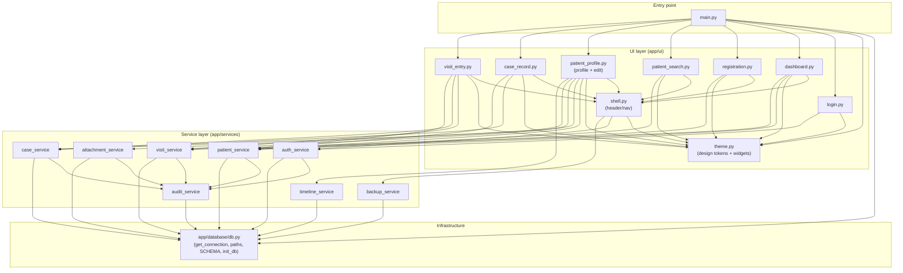

# Wise PMS — Module Dependency Map (As-Built)

Companion to [`ARCHITECTURE.md`](./ARCHITECTURE.md). This shows how each
current module imports/uses the others. The direction of every arrow is
"**imports / depends on**".

## 1. Full internal dependency graph

## 2. Per-module dependency table

| Module | Imports (internal) | Imports (external) | Imported by |
| ------ | ------------------ | ------------------ | ----------- |
| `main.py` | db, theme, login, dashboard, registration, patient_search, patient_profile, case_record, visit_entry | `flet` | — (entry) |
| `app/database/db.py` | — | `os`, `sqlite3`, `bcrypt` | main + **all services** |
| `app/services/audit_service` | db | — | auth, patient, case, visit, attachment |
| `app/services/auth_service` | db, audit | `bcrypt` | login, shell |
| `app/services/patient_service` | db, audit | `typing` | dashboard, registration, search, profile, case, visit |
| `app/services/case_service` | db, audit | `typing` | profile, case, visit |
| `app/services/visit_service` | db, audit | `re`, `typing` | dashboard, profile, visit |
| `app/services/attachment_service` | db, audit | `os`, `shutil`, `datetime` | profile |
| `app/services/timeline_service` | db | `typing` | profile |
| `app/services/backup_service` | db | `os`, `zipfile`, `datetime` | shell |
| `app/ui/theme` | — | `flet` | shell + every view |
| `app/ui/shell` | theme, auth, backup | `flet` | every authenticated view |
| `app/ui/login` | theme, auth | `flet` | main |
| `app/ui/dashboard` | theme, shell, patient, visit | `flet` | main |
| `app/ui/registration` | theme, shell, patient | `flet` | main |
| `app/ui/patient_search` | theme, shell, patient | `flet` | main |
| `app/ui/patient_profile` | theme, shell, patient, case, visit, attachment, timeline | `flet` | main |
| `app/ui/case_record` | theme, shell, case, patient | `flet` | main |
| `app/ui/visit_entry` | theme, shell, visit, case, patient | `flet` | main |

## 3. Key observations from the graph

- **`db.py` is the universal sink.** All 8 services depend on it for
  `get_connection` and path constants. This is the natural place to split into
  `config/paths.py` + `core/database.py`.
- **`audit_service` is a cross-cutting concern** pulled in by every *write*
  service. It fits a shared/core "cross-cutting" home.
- **`theme.py` is the universal UI dependency** (design system) → belongs in
  `shared/`.
- **`shell.py` reaches down into services** (`auth`, `backup`) — the only UI
  chrome module that calls business logic directly. In the target structure
  this becomes a shared shell whose actions are injected/handled by controllers.
- **The graph is a clean DAG** (`ui → services → infra`, plus `services →
  audit → infra`). There are **no import cycles**. This is the property the
  refactor must preserve.
- **Fan-in hotspots:** `db.py` (in-degree 9), `theme.py` (in-degree 8),
  `patient_service` (in-degree 6), `shell.py` (in-degree 6). These are the
  modules whose relocation needs compatibility shims during migration.

## 4. Coupling notes for the migration

| Coupling | Where | Refactor treatment |
| -------- | ----- | ------------------ |
| Path constants (`ATTACHMENTS_DIR`, `BACKUPS_DIR`, `DB_PATH`, `BASE_DIR`) imported from `db.py` | attachment_service, backup_service | Move to `app/config/paths.py`; re-export from `db.py` shim |
| `get_connection` imported everywhere | all services | Move to `app/core/database.py`; re-export from `db.py` shim |
| Domain constants duplicated | registration, profile, visit_entry | Centralize in `app/config/constants.py` |
| `extract_prescription_items` (pure function) lives in a CRUD service | visit_service, imported by visit_entry UI | Move to `app/utils` / domain `services`, keep re-export |
| `shell` calls `auth.logout` + `backup.backup_now` | shell.py | Keep working; header actions later routed through controllers |
