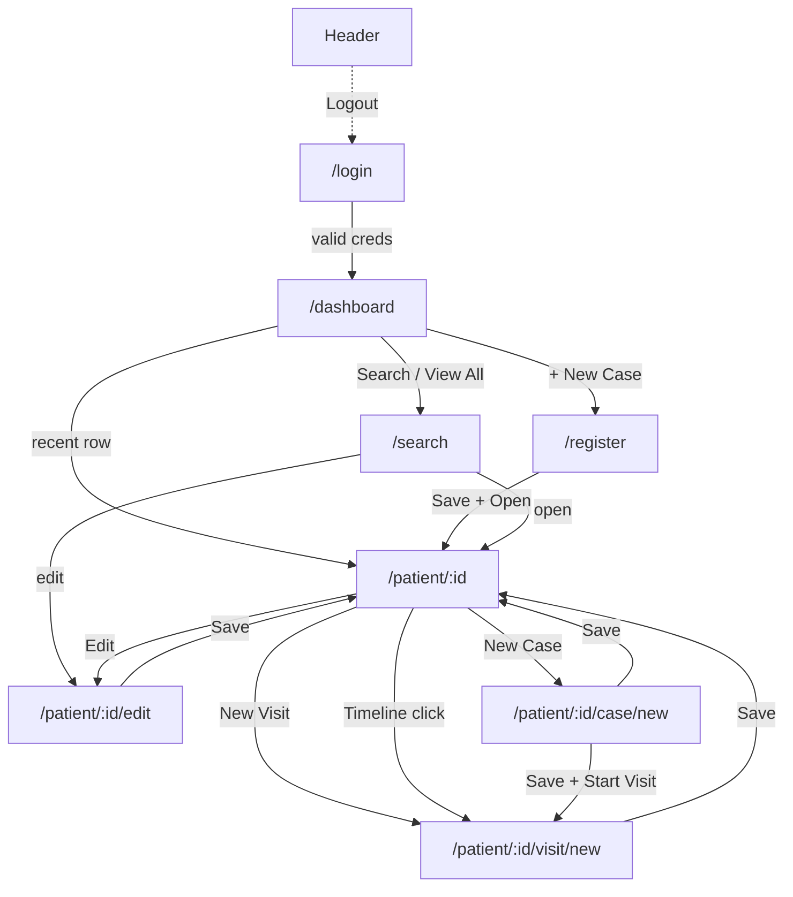
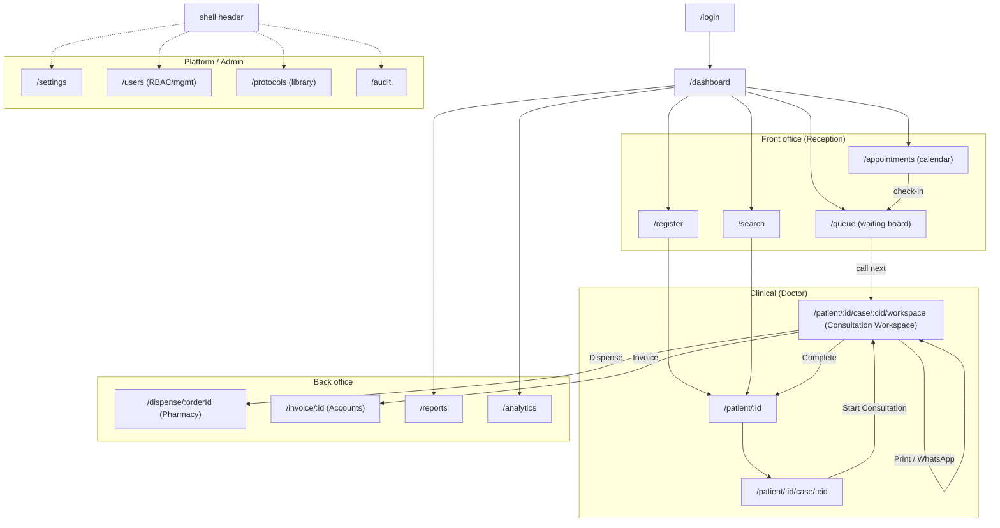

# Screen Flow — Specification

> **Status:** Design only (Phase 2). **Last updated:** 2026-07-20.
> The map of every screen, route, and navigation edge — built today and planned.
> Grounds [`CONSULTATION_WORKSPACE.md`](./CONSULTATION_WORKSPACE.md) and the
> workflow specs. Subordinate to
> [`PRODUCT_CONSTITUTION.md`](./PRODUCT_CONSTITUTION.md).

## 1. Purpose

One place to see how a user moves through WiseOS Health. It distinguishes what
**exists** from what is **planned**, so implementation phases know exactly which
screens and routes they add. All screens (except `/login`) are wrapped by the
shared shell and built from `theme.py` + `widgets.py` (Constitution Art. V).

## 2. Screens today (built)

| Screen | Route | Module |
| ------ | ----- | ------ |
| Login | `^/login$` | authentication |
| Dashboard | `^/dashboard$` | dashboard |
| Registration | `^/register$` | registration |
| Patient Search | `^/search$` | patients |
| Patient Profile (+ Edit) | `^/patient/(?P<pid>\d+)$`, `.../edit$` | patients |
| Case Record | `^/patient/(?P<pid>\d+)/case(?:/(?P<cid>new\|\d+))?$` | cases |
| Visit Entry (Consultation) | `^/patient/(?P<pid>\d+)/visit(?:/(?P<vid>new\|\d+))?$` | visits |

The header workflow bar (Dashboard · Search · Register · Backup · Logout) gives
global jumps from any authenticated screen — navigation is not strictly
hierarchical.

## 3. Navigation today (built)

## 4. Target screen map (built + planned)

> Legend: front-office and clinical screens exist partially today (Register,
> Search, Profile, Case, Visit). Appointments, Queue, Workspace, Dispense,
> Invoice, Reports, Analytics, Settings, Users, Protocols, Audit-view are
> **planned** (each arrives with its module + route registration).

## 5. Planned routes (target)

| Route | Screen | Module | Gated by (RBAC) |
| ----- | ------ | ------ | --------------- |
| `^/appointments$` | Appointment calendar | Appointments | appointments.manage |
| `^/queue$` | Waiting queue board | Waiting Queue | queue.manage |
| `^/patient/(?P<pid>\d+)/case/(?P<cid>\d+)/workspace(?:/visit/(?P<vid>new\|\d+))?$` | Consultation Workspace | visits+ | visits.consult |
| `^/dispense/(?P<order_id>\d+)$` | Dispense order | Dispensing | dispensing.fulfil |
| `^/invoice/(?P<id>\d+)$` | Invoice | Billing | billing.manage |
| `^/reports$` | Reports | Reports | reports.view |
| `^/analytics$` | Analytics | Analytics | reports.view |
| `^/settings$` | Settings | Settings | settings.edit |
| `^/users$` | User management | Roles/Users | users.manage |
| `^/protocols(?:/(?P<id>new\|\d+))?$` | Protocol library | Protocols | cases.manage |
| `^/audit$` | Audit viewer | Audit | audit.view |

All follow the router contract (named regex groups, `new` sentinel, session guard,
friendly-fallback on error — Constitution Art. V §4). RBAC gating is F3.

## 6. Navigation zones (target IA)

- **Front office** — Appointments, Queue, Register, Search. Reception's home.
- **Clinical** — Profile → Case → **Consultation Workspace**. The Doctor's home;
  the Workspace is the single screen for the consultation (Constitution Art. II §3).
- **Back office** — Dispense, Invoice, Reports, Analytics. Pharmacy/Accounts.
- **Platform/Admin** — Settings, Users, Protocols, Audit. Administrator.

The shell's workflow bar surfaces the zones relevant to the logged-in role (once
RBAC lands); today it shows the built global jumps.

## 7. Deep-linking & state

- State lives in the **route string** + `page.session` (no in-memory view cache);
  every navigation rebuilds from the DB (existing model). Keep views cheap to
  rebuild (Constitution Art. V; L11).
- The Workspace supports `?section=<panel>` deep links; the visit/case routes
  support `?case=<id>` (existing) query passing.

## 8. Manual test checklist (per new screen)

- [ ] Route matches the router contract (static + dynamic + fallback).
- [ ] Screen wraps in the shared shell; login is the only exception.
- [ ] Unauthorized role is redirected with a friendly message (once RBAC lands).
- [ ] No horizontal page scroll at 1366×768.
- [ ] Router-contract test covers the new route.

## 9. Dependencies

Built screens exist now. Planned screens arrive with their modules (Appointments,
Queue, Workspace, Dispensing, Billing, Reports, Analytics, Settings, Users,
Protocols) and register their own `ROUTES` in `app/bootstrap.py`; RBAC (F3) adds
per-route gating. No screen edits another module (Constitution Art. III §2).
</content>
